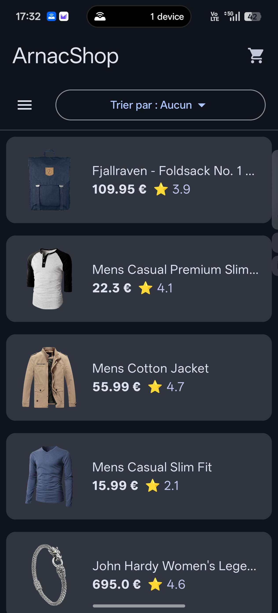
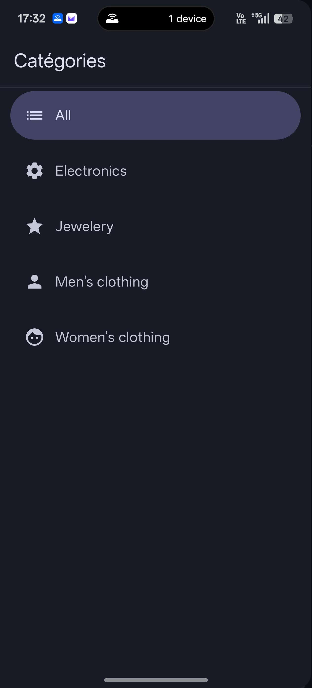
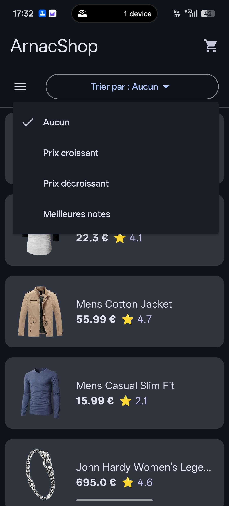
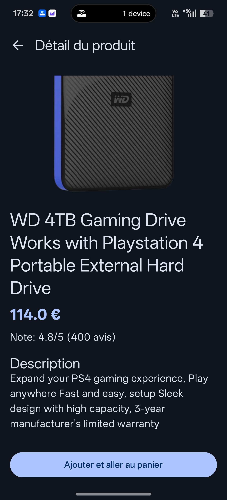
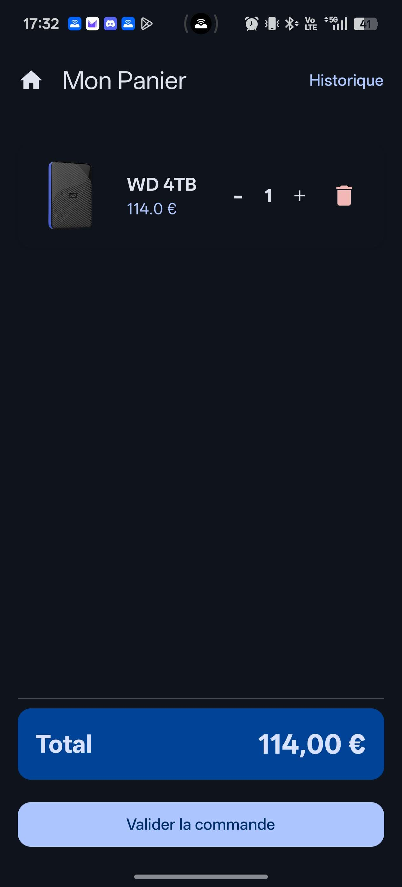
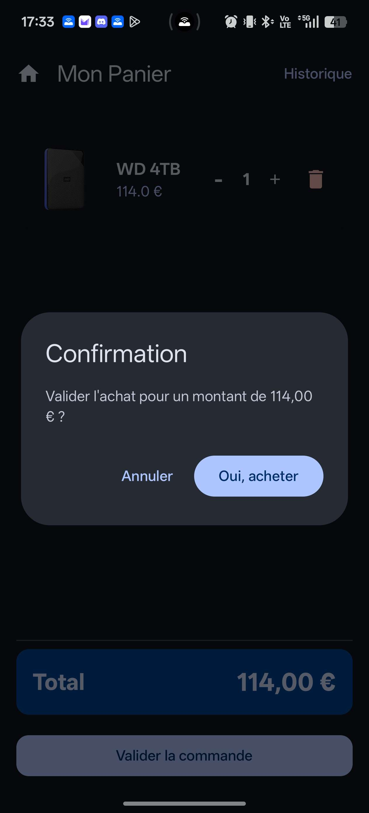
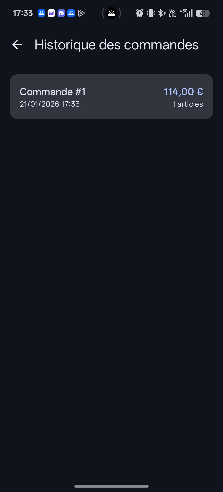

# ArnacShop - Application E-Commerce Android

Ce projet est une application Android de e-commerce moderne développée avec **Jetpack Compose**. Elle permet de parcourir des produits, de gérer un panier local et de consulter un historique de commandes.

### [Télécharger ICI ](https://github.com/IcePlayer974/Tp_AndroidStudio/blob/main/ArnacShop.apk)

## 🚀 Fonctionnalités

- **Navigation fluide** : Utilisation d'un `ModalNavigationDrawer` pour naviguer entre la boutique, le panier et l'historique.
- **Catalogue de produits** : Récupération dynamique des données depuis l'API [FakeStoreAPI](https://fakestoreapi.com/).
- **Filtrage et Tri** : Possibilité de filtrer par catégorie et de trier par prix ou par note.
- **Détails produits** : Vue détaillée avec description, image haute résolution et avis.
- **Gestion du Panier** : Ajout/suppression de produits et modification des quantités avec persistance locale.
- **Historique des commandes** : Consultation des achats passés (date et montant total).

## 🛠️ Stack Technique

- **Langage** : Kotlin
- **Interface Utilisateur** : Jetpack Compose (Material 3)
- **Architecture** : MVVM (Model-View-ViewModel)
- **Gestion Réseau** : Retrofit & Coil (chargement d'images)
- **Base de données locale** : Room Database
- **Injection de dépendances** : Architecture standard Android avec ViewModels
- **Navigation** : Compose Navigation

## 🏗️ Architecture et Choix Techniques

### Architecture MVVM
L'application est découpée en couches pour assurer la maintenabilité :
- **Model** : Représentation des données (`Product`, `CartEntity`, `OrderEntity`).
- **ViewModel** : Gestion de la logique métier (`ProductViewModel`, `CartViewModel`) et exposition des données via `StateFlow`.
- **View** : Composables déclaratifs observant l'état fourni par les ViewModels.

### Persistance des données
Le choix s'est porté sur **Room** pour le panier et l'historique afin de garantir que les données de l'utilisateur ne soient pas perdues lors de la fermeture de l'application ou en cas de perte de réseau.

### Gestion du réseau
L'utilisation de **Retrofit** couplée à un `ApiService` permet une gestion propre des appels asynchrones. Les images sont gérées de manière performante grâce à **Coil**, qui gère le cache et le chargement en arrière-plan.

## 🚧 Points de Blocage et Solutions

**Synchronisation du Panier** :

- *Problème* : Difficulté à mettre à jour l'UI en temps réel lors de la modification des quantités.
- *Solution* : Utilisation de Flow dans le DAO de Room pour observer les changements en base de données et les propager instantanément via le ViewModel.

**Gestion de la Navigation** :

- *Problème* : Complexité pour passer des objets complexes entre les écrans.
- *Solution* : Passage des identifiants (ID) dans les arguments de route et récupération de l'objet correspondant dans le ViewModel de l'écran de destination.

**Validation des Commandes** :

- *Problème* : S'assurer que le panier reste persistance sauf après l'enregistrement réussi de la commande ou il est vidé.
- *Solution* : Utilisation de transactions ou d'opérations séquentielles dans les coroutines pour garantir l'intégrité des données.

## 📁 Structure du Projet

- `fr.delplanque.tp_androidstudio`
    - `ApiService.kt` : Configuration de Retrofit.
    - `CartDatabase.kt` : Configuration de Room.
    - `CartViewModel.kt` & `ProductViewModel.kt` : Logique applicative.
    - `MainActivity.kt` : Point d'entrée et gestion de la navigation.
    - `screens/` : Contient les différents écrans de l'application (List, Detail, Cart, History).
    - `ui.theme/` : Définition des couleurs, polices et thèmes Material 3.
 
## Aperçu du projet

### Acceuil 

### Sélection catégorie

### Sélection élément de tri

### Page du détail produit

### Page du panier

### Confirmation d'achat

### Historique de commande 

---
*Projet réalisé par DELPLANQUE Julien et VERGNIOLE Yohann dans le cadre du module de Développement Mobile (Android) (2025-2026).*
